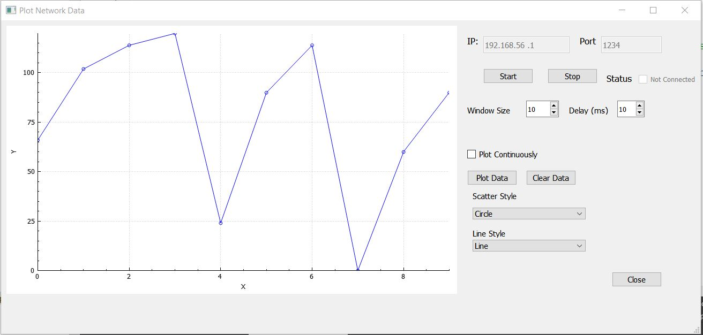

# Network Plot Server



This program creates a local server at port 1234. Client can send data in form of JSON packet:

```
[
  {X:1,2,3,4,5},
  {Y:2.5,6.5,453.5,787,435}
]
```

This program has multithreading so multiple clients can connect at the same time.
