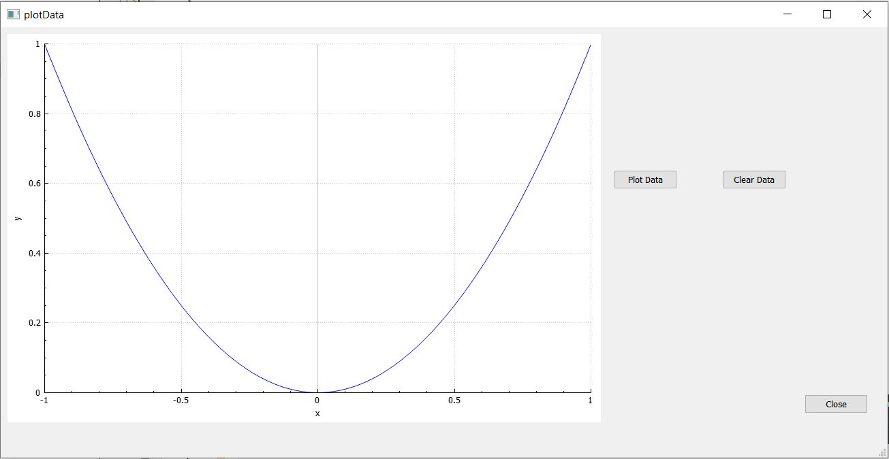
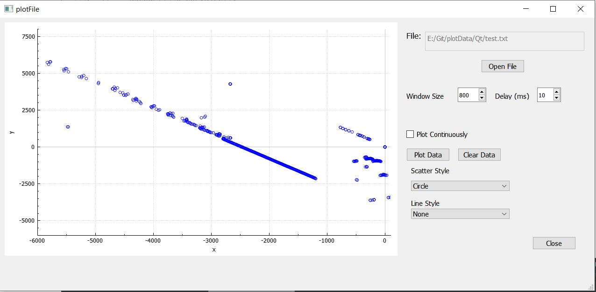

# Plot Data
Plot different data using different libraries


## Qt

### Simple Plot

Qt/simplePlot project plots a simple 2D generated graph



### File Plot

Qt/filePloot projects plots x,y from txt file.

File format should be:
```
x1 y1
x2 y2
.
.
.
.
.
```

